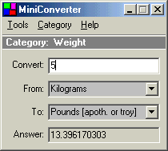



## Mini Converter 2\.0\.1

### Description

A complete conversion program that will convert virtually anything (over 4000 conversions already programed).... also has a wide range of categories to choose from. Options to add/remove more categories and units. I have a couple more improvements still to do to it so message me if you want any updates sent to you.
 
### More Info
 

             |
---                |---
**Submitted On**   |2004-01-21 01:22:30
**By**             |[Daniel Cassar](https://github.com/Planet-Source-Code/PSCIndex/blob/master/ByAuthor/daniel-cassar.md)
**Level**          |Advanced
**User Rating**    |4.6 (23 globes from 5 users)
**Compatibility**  |VB 6\.0
**Category**       |[Complete Applications](https://github.com/Planet-Source-Code/PSCIndex/blob/master/ByCategory/complete-applications__1-27.md)
**World**          |[Visual Basic](https://github.com/Planet-Source-Code/PSCIndex/blob/master/ByWorld/visual-basic.md)
**Archive File**   |[Mini\_Conve1698891242004\.zip](https://github.com/Planet-Source-Code/daniel-cassar-mini-converter-2-0-1__1-51214/archive/master.zip)

